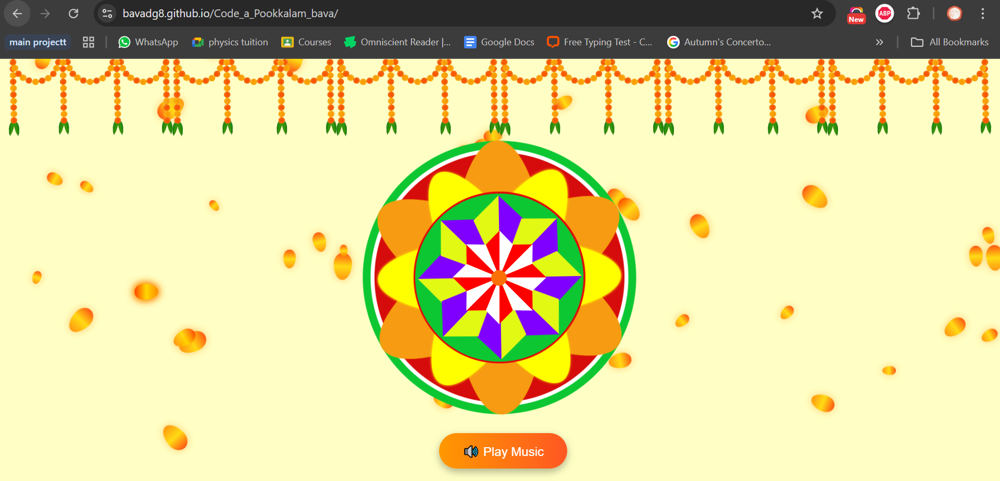
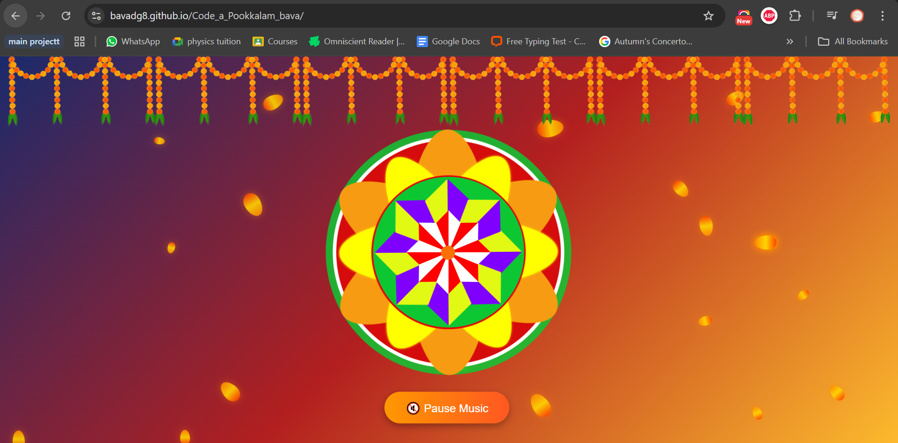

# 🌸 Code-a-Pookkalam  

During my Onam holidays, I joined the **TinkerHub Code-a-Pookkalam** challenge and created a **digital pookalam** 🌼.  

## ✨ Explore the Project  
🔗 **[View Pookkalam Website](https://bavadg8.github.io/Code_a_Pookkalam_bava/)**  

> 💡 P.S: Don’t forget to click the **"Play Music"** button for a festive vibe 🎶  

## 📸 Screenshots  

Here are some glimpses of my digital pookkalam:  

  
  

---

🌼 Wishing you all a joyful **Onam** and **happy coding!** 🎉💻  
